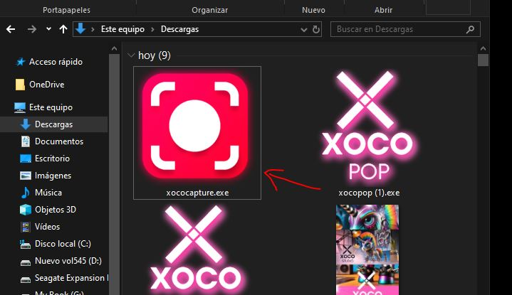

# Xococapture

Xococapture es una herramienta de captura de pantalla y dibujo libre desarrollada en Python. Permite seleccionar áreas específicas de la pantalla y realizar anotaciones directamente sobre la captura antes de guardarla o copiarla al portapapeles. Es ideal para presentaciones, tutoriales y anotaciones rápidas.

## Características
- **Captura de pantalla personalizada** con selección de área.
- **Modo de dibujo libre** para realizar anotaciones directamente en la pantalla.
- **Guardado en portapapeles** y apertura directa en Photoshop.
- **Soporte para atajos de teclado** para cambiar el color y el grosor del trazo.
- **Ventana flotante minimalista** con emojis para fácil acceso a las funciones principales.

### Video de demostración
[Ver video de demostración](https://www.youtube.com/watch?v=i-6FQpiGJdk&t=2s)

## Instalación y Ejecución
Descarga el ejecutable desde el siguiente enlace:
   [Descargar Xococapture](https://drive.google.com/file/d/1Gn51XQqtvHl5q9_2TJWYGmyJnxgY2jji/view?usp=sharing)

## Uso

- **Captura de pantalla:** Haz clic en el botón 📷 o presiona el botón principal.
- **Modo de dibujo libre:** Usa el botón ✏️ para dibujar libremente en la pantalla.
- **Guardar desde el portapapeles:** Haz clic en 📥 para guardar la imagen.
- **Abrir en Photoshop:** Usa el botón 🖼️ para abrir la imagen directamente en Photoshop.
- **Cerrar la aplicación:** Haz clic en ❌.

### Atajos de teclado
- **Cambiar modo de selección/dibujo:** Tecla `P`
- **Aumentar grosor del trazo:** Tecla `+`
- **Disminuir grosor del trazo:** Tecla `-`
- **Cambiar color del trazo:** Teclas `1-7` (Negro, Blanco, Amarillo, Azul, Verde, Magenta, Rojo)
- **Salir:** `Esc`

## Capturas de pantalla instalación

## Contribuciones
Si deseas contribuir, realiza un fork del repositorio y abre una solicitud de extracción (Pull Request). Todas las contribuciones son bienvenidas.

---

_Disfruta de Xococapture y haz tus capturas de pantalla más interactivas y divertidas!_

## Descargo de Responsabilidad

**Importante:** El uso de este código es bajo total responsabilidad del usuario. ** Xocostudio** no se hace responsable por ningún tipo de mal uso, daño directo o indirecto, pérdida de datos, o cualquier otro perjuicio que pueda derivarse del uso de este software.

### Sin Garantías

El software se proporciona "tal cual", sin garantías de ningún tipo, ya sean expresas o implícitas. Esto incluye, pero no se limita a, las garantías de comerciabilidad, adecuación para un propósito particular y no infracción.

### Exención de Responsabilidad

Los autores no son responsables por cualquier reclamación, daño u otra responsabilidad que surja del uso del software, ya sea en una acción de contrato, agravio o de otra manera, que surja de, fuera de o en conexión con el software o el uso u otros tratos en el software.

### Uso del Código

Al descargar y utilizar este código, aceptas hacerlo bajo tu propio riesgo. Es tu responsabilidad asegurarte de que el software es adecuado para tus necesidades y de tomar todas las precauciones necesarias para evitar posibles daños o pérdidas.

Si tienes alguna pregunta o necesitas más información, por favor contacta a Xocostudio.

---

*¡Gracias por utilizar nuestro software! Asegúrate de leer y entender este descargo de responsabilidad antes de proceder.*

